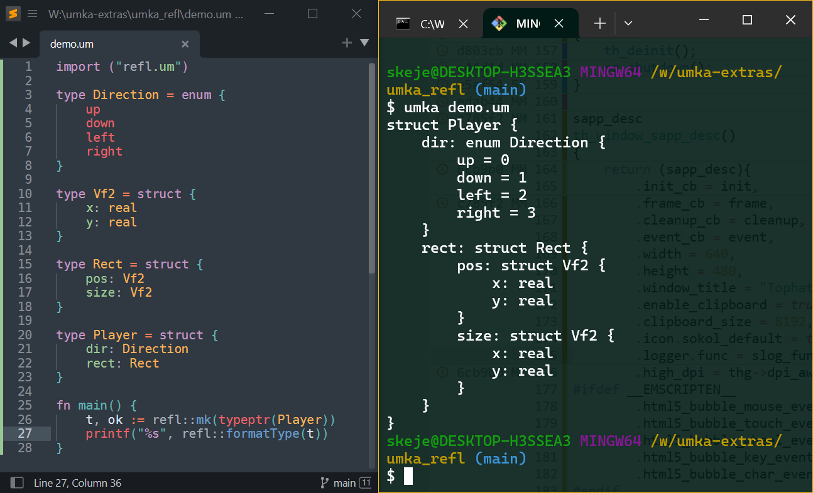

# Reflection for Umka

An Umka type reflection library, without any modifications to Umka itself.

Look into main.um for more examples.

# Building

`./build.bat` on Windows (requires MSVC installed).
`./build.sh` on Linux (requries gcc).

# Features

- [x] Enums
- [x] Structs
- [ ] Interface
- [ ] Map
- [ ] Array
- [ ] Dynarray
- [ ] Builtin
- [ ] Pointer
- [x] Closures